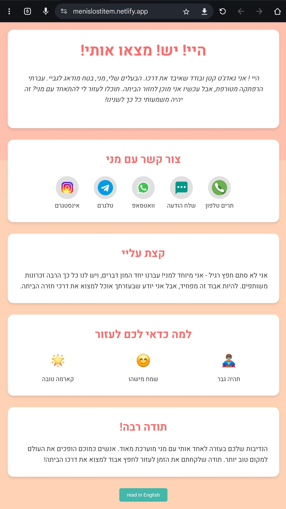

# Lost Item Landing Page

## Overview

This project is a responsive, bilingual (Hebrew/English) landing page designed to help reunite lost items with their owners. It's specifically created for use with NFC tags, allowing people who find lost items to easily contact the owner.

## Features

- Responsive design optimized for mobile devices (Android and iOS)
- Bilingual support (Hebrew and English) with easy language toggle
- Contact options including phone, SMS, WhatsApp, Telegram, and Instagram
- Engaging animations and color transitions
- Sections for item story, owner contact, and reasons to help

## Technologies Used

- HTML5
- CSS3 (with custom properties and animations)
- JavaScript (ES6+)
- Google Fonts (Heebo)

## How to Use

1. Clone this repository to your local machine.
2. Open the `index.html` file in a web browser to view the landing page.
3. To deploy, upload the `index.html` file and the `screenshot.jpg` to your web hosting service.
4. Link the deployed URL to your NFC tag.

## Customization

To customize this landing page for your own lost item:

1. Open the `index.html` file in a text editor.
2. Update the contact information in the `<a href="...">` tags within the `.contact-options` div.
3. Modify the text content in both Hebrew and English or your other language, within the `translations` object in the JavaScript section.
4. Replace `screenshot.jpg` with a screenshot of your customized page.

## Contributing

Contributions, issues, and feature requests are welcome! Feel free to check [issues page](https://github.com/meniviner/lost-item-landing-page/issues) if you want to contribute.

## License

This project is [MIT](https://choosealicense.com/licenses/mit/) licensed.

## Contact

Meni Viner - 
roject Link: [menis-lost-item](https://menislostitem.netlify.app/)
